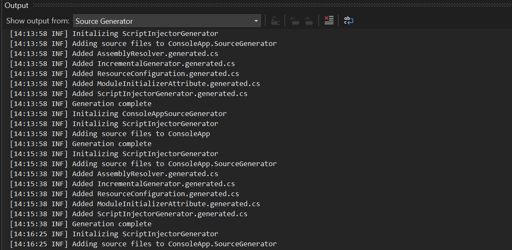
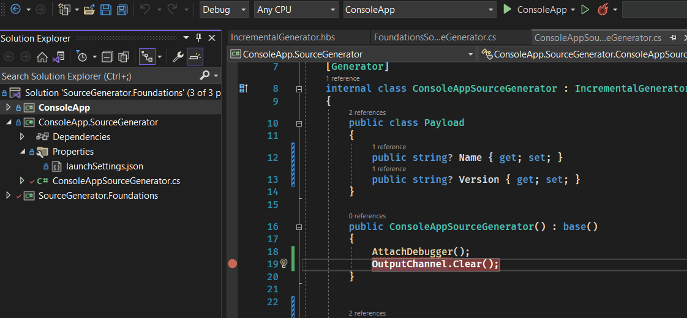
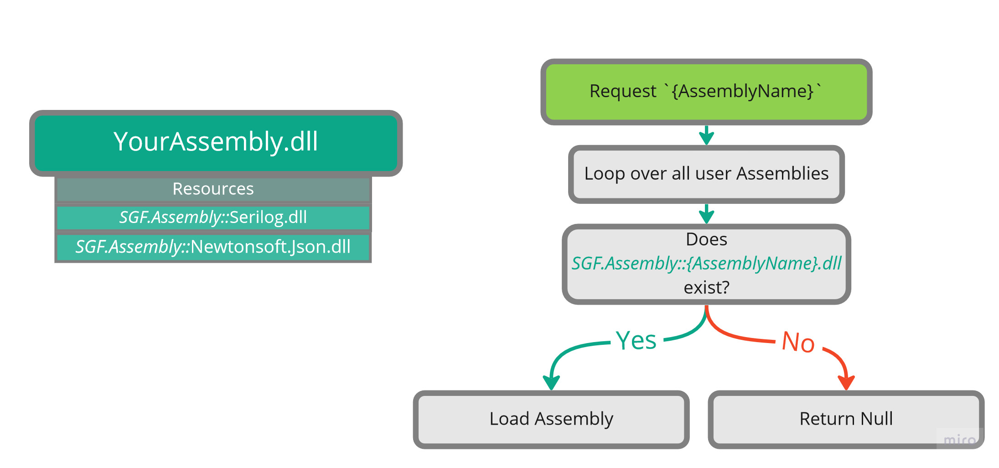

 

# SourceGenerator.Foundations

Source Generators are awesome but working with them can be a bit painful. This library is designed to try to smooth out some bumps. To get started using the library just add a nuget reference. Once that is done you will have access to new types contained within your assembly.

## Quick Start

To get started all you need to do is add the NuGet package reference. You may or may not have to restart Visual Studio for the new types to show up. Then implement the base class `IncrementalGenerator` and apply the `[SgfGenerator]` attribute to your type;

```cs
namespace Example
{
    // IncrementalGenerator, is a generated type from `SourceGenerator.Foundations'
    [SgfGenerator]
    public class ExampleSourceGenerator : IncrementalGenerator 
    {
        public ExampleSourceGenerator() : base("ExampleSourceGenerator")
        {
            
        }

        // SgfInitializationContext is a wrapper around IncrementalGeneratorInitializationContext
       protected override void OnInitialize(SgfInitializationContext context)
       {
            // Attaches Visual Studio debugger without prompt 
            AttachDebugger();

            // Writes output to Visual Studios output window
            WriteLine("Hello World");
       }
    }
}
```

> 🛈 You don't apply the `SourceGenerator` attribute or implement the `IIncrementalGenerator` interface. Behind the scenes Source Generator Foundations is generating a class that will host your generator. This is done so that we can capture all errors and also resolve any type loading.


# What is inside?

There is a series of features this library hopes to provide.

## Nuget Nightmares

Source generators run in a unique place and their references don't act the same. If you have a source generator that attempts to reference a NuGet package it will fail to be found at runtime. The reason is the source generators need to have their dll's alongside the running process but that also means that the project the generator is running aginst will to. If you look online the best option is to do this:

```xml
<ItemGroup>
    <PackageReference Include="Newtonsoft.Json" Version="13.0.1" GeneratePathProperty="true" PrivateAssets="all" />
</ItemGroup>
<ItemGroup>
    <EmbeddedResource Include="$(PKGNewtonsoft_Json)\lib\netstandard2.0\Newtonsoft.Json.dll" Visible="false" />
</ItemGroup>
```
This MSBuild logic adds a reference to `Newtonsoft.Json` version `13.0.1` and sets a few attributes. Using `GeneratePathProperty="true"` will emit the variable `PKGNewtonsoft_Json` which points at the root of the NuGet package on disk. Using `EmbeddedResource` we then give the full path to the dll. When the project is compiled the dlls will be embeded as a resource.

This works well but requires a lot of boilerplate. Even worse is this is just for one package. You would need to repeat this for every dependency and any transitive ones as well. This gets out of hand very fast.


*Source.Generator foundations automates this all for you. Just add your NuGet references and nothing else*

## Logging Framework
Source generator run in the background and it can be very hard to debug. If you want to make a log you have to write the files to disk and open to read them. 

With this library we leverage the existing Output window and create an entry for each source generator. This is all done by using some Visaul Studio api. Internally this uses a custom Skin for [Serilog.net](https://serilog.net/). Every generator comes with a `Logger` property allowing you to output any information




### **Captured Exceptions**

When a source generator throws an exception it normally just stops. In the base library we process all exceptions and forward their output to the `Source Generator` output tab. 

```ini
# Build Window 
6>CSC : warning CS8032: An instance of analyzer ConsoleApp.SourceGenerator.ConsoleAppSourceGenerator cannot be created from D:\Repositories\SourceGenerator.Foudations\src\Sandbox\ConsoleApp.SourceGenerator\bin\Debug\netstandard2.0\ConsoleApp.SourceGenerator.dll : Exception has been thrown by the target of an invocation..

# Source Generator Window 
[13:02:39 ERR] ConsoleApp | Unhandled exception was throw while running the generator ConsoleApp
System.NotImplementedException: The method or operation is not implemented.
   at ConsoleApp.SourceGenerator.ConsoleAppSourceGenerator.PostInit(IncrementalGeneratorPostInitializationContext obj) in D:\Repositories\SourceGenerator.Foudations\src\Sandbox\ConsoleApp.SourceGenerator\ConsoleAppSourceGenerator.cs:line 42
   at SGF.SgfInitializationContext.<>c__DisplayClass19_0.<RegisterPostInitializationOutput>b__0(IncrementalGeneratorPostInitializationContext context) in D:\Repositories\SourceGenerator.Foudations\src\Sandbox\ConsoleApp.SourceGenerator\SourceGenerator.Foundations\SGF.Generators.ScriptInjectorGenerator\SgfInitializationContext.generated.cs:line 106

```
In this case my source generator just throws `NotImplementedException` but all details are lost with the build in framework. Using the source generator tab it will give you a full call stack.

This is done by implementing a wrapper around `IncrementalGeneratorInitializationContext` which is called `SgfInitializationContext`. This will wrap every single subscription in a `try {} catch {}` and give details whenever an unhandled exception is thrown.


### Debugging 

To be able to debug a source generators one of the suggested methods is to add the following.

```cs
static CustomSourceGenerator()
{
    Debugger.Launch();
}
```
This will popup the following window and you have to select your visual studio instance. Instaed with foundations you can just call a single method and break points work from that point on.



## Helpers 

Included in the project is a series of helper classes to help you while working on your generator.

### SGFPath 

* Contains methods for normalizing paths which does the following 
  * `files/../cats` -> `/cats`
  * [Windows] `files\cats/dogs` -> `\\files\\cats\\dogs` 
  * [Linux|Mac] `files\cats/dogs` -> `/files/cats/dogs` 
* Combing paths without having to worry about leading or trailing slashes.

# How it works

## Assembly Resolver
When your source generator runs it needs to find it's dependencies and this is often what fails. When you want to provide external packages you will have to write your own resolve that is able to locate the required assemblies. So instead we have the `ScriptInjector` inject an implemention for you. This assembly resolver will loop over all the resources in the current assembly and look for all resources that start with `SGF.Assembly::`. If the assembly being requested to be loaded exists in the resources, it's extracted and loaded into the current appdomain. 



You can embed any assemblies you want by adding them to `<SGF_EmbeddedAssembly Include="Your Assembly Path"/>`

## Diagnostic Analyzer

Included with this package is a code analyzer that will be used to catch common mistakes when working with this library.


### `SGF1001`
**Has SgfGenerator Attribute**

Any class that inherits from `IncrementalGenerator` is required to have the `SgfGenerator` attribute applied to it. 

```cs
// Error 
public class MyGenerator : IncrementalGenerator 
{
    public MyGenerator() : base("MyGenerator")
    {}
}
```

To fix the error just apply the attribute.

```cs 
// Fixed 
[SgfGeneratorAttribute]
public class MyGenerator : IncrementalGenerator 
{
    public MyGenerator() : base("MyGenerator")
    {}
}
```

### `SGF1002`

**Prohibit Generator Attribute**

If an `IncrementalGenerator` has the `Generator` attribute applied it will cause a compiler error. The reason being that the `Generator` attribute is used on classes that implement `IIncrementalGenerator` which `IncrementalGenerator` does not. SGF has it's own attribute to not confuse roslyn. SGFs `IncrementalGenerator` is run from within a wrapper to help capture exceptions and handle runtime type resolving. 

```cs
// Error 
[Generator]
public class MyGenerator : IncrementalGenerator 
{
    public MyGenerator() : base("MyGenerator")
    {}
}
```

To fix the error just remove the attribute.

```cs 
// Fixed 
public class MyGenerator : IncrementalGenerator 
{
    public MyGenerator() : base("MyGenerator")
    {}
}
```

### `SGF1003`
**Has Default Constructor**

`IncrementalGenerator` require a default constructor so they can be instantiated at runtime. If no constructor is defined the generator will never be run. 

```cs
// Error 
public class MyGenerator : IncrementalGenerator 
{
    public MyGenerator(string name) : base(name)
    {}
}
```

Add a default constructor that takes no arguments.

```cs 
// Fixed 
public class MyGenerator : IncrementalGenerator 
{
    public MyGenerator() : base("MyGenerator")
    {}
}
```

## Unit Tests 
You can write unit test to validate that your source generators are working as expected. To do this for this library requires a very tiny amount of extra work. You can also look at the [example project](src\Sandbox\ConsoleApp.SourceGenerator.Tests\TestCase.cs) to see how it works. 

The generated class will all be internal so your unit test assembly will need to have viability.

```csharp
using System.Runtime.CompilerServices;

[assembly: InternalsVisibleTo("ConsoleApp.SourceGenerator.Tests")]
```

Then for your unit test functions the only difference will be that instead of creating an instance of your class you create an instance of the `Hoist` class.

```c#
// Create the instance of our generator and set whatever properties 
ConsoleAppSourceGenerator generator = new ConsoleAppSourceGenerator()
{
    Explode = true
};
// Build the instance of the wrapper `Host` which takes in your generator.
ConsoleAppSourceGeneratorHoist host = new

// From here it's just like testing any other generator
ConsoleAppSourceGeneratorHoist(generator);
GeneratorDriver driver = CSharpGeneratorDriver.Create(host);
driver = driver.RunGenerators(compilation);
```
The only unique feature is the wrapper class `{YourGeneratorName}Host`. This class is an internal feature of `SGF` and is used to make sure all dependencies are resolved before calling into your source generator. 

## Project Layout  

This library is made up of quite a few different components leveraging various techniques to help
make the experience of integrating the library simple. Below I break down the purpose of each project and what they provide to you as the end users.

### Source.Generator.Foundations 

A very small library that only appears to contain a C# analyzer for adding errors and warnings when trying to use this library. However once compiled this dll will have embedded as a resource every other project that is needed during compilation. 


### Source.Generator.Foundations.Contracts

Contains common classes and utility methods that can be leveraged by source generators. 

### Source.Generator.Foundations.MSBuild 

Contains a custom MSBuild C# target implementation used to figure out which assemblies should be embedded as resources and which should be ignored. For example this will not embed any resources that are part of `.netstandard`.

### Source.Generator.Foundations.Shared 

A shared project that every project that references this will have the files copied to it. 


## Attribution 
Icon by <a href="https://www.flaticon.com/free-icons/drywall" title="drywall icons">Drywall icons created by HAJICON - Flaticon</a>