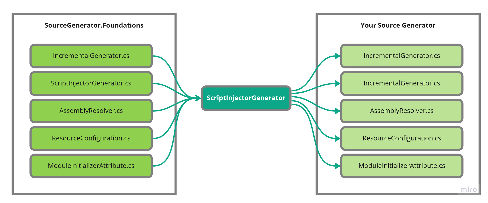

 

# SourceGenerator.Foundations

Source Generators are awesome but working with them can be a bit painful. This library is designed to try to smooth out some bumps. To get started using the library just add a nuget reference. Once that is done you will have access to new types contained within your assembly.

## Quick Start

To get started all you need to do is add the NuGet package reference. You may or may not have to restart Visual Studio for the new types to show up. Then implement the base class `IncrementalGenerator`. 

```cs
namespace Example
{
    // IncrementalGenerator, is a generated type from `SourceGenerator.Foundations'
    public class ExampleSourceGenerator : IncrementalGenerator 
    {
        // SgfInitializationContext is a wrapper around IncrementalGeneratorInitializationContext
       protected override void OnInitialize(SgfInitializationContext context)
       {
            // Attaches Visaul Studio debugger without prompt 
            AttachDebugger();

            // Writes output to Visual Studios output window
            WriteLine("Hello World");
       }
    }
}
```

# What is inside?

There is a series of features this library hopes to provide.

## Nuget Nightmares

Source generators run in a unique place and their references don't act the same. If you have a source generator that attempts to reference a NuGet package it will fail to be found at runtime. The reason is the source generators need to have their dll's alongside the running process but that also means that the project the generator is running aginst will to. If you look online the best option is to do this:

```xml
<ItemGroup>
    <PackageReference Include="Newtonsoft.Json" Version="13.0.1" GeneratePathProperty="true" PrivateAssets="all" />
</ItemGroup>
<ItemGroup>
    <EmbeddedResource Include="$(PKGNewtonsoft_Json)\lib\netstandard2.0\Newtonsoft.Json.dll" Visible="false" />
</ItemGroup>
```
This MSBuild logic adds a reference to `Newtonsoft.Json` version `13.0.1` and sets a few attributes. Using `GeneratePathProperty="true"` will emit the variable `PKGNewtonsoft_Json` which points at the root of the NuGet package on disk. Using `EmbeddedResource` we then give the full path to the dll. When the project is compiled the dlls will be embeded as a resource.

This works well but requires a lot of boilerplate. Even worse is this is just for one package. You would need to repeat this for every dependency and any transitive ones as well. This gets out of hand very fast.


*Source.Generator foundations automates this all for you. Just add your NuGet references and nothing else*

## Logging Framework
Source generator run in the background and it can be very hard to debug. If you want to make a log you have to write the files to disk and open to read them. 

With this library we leverage the existing Output window and create an entry for each source generator. This is all done by using some Visaul Studio api. Internally this uses a custom Skin for [Serilog.net](https://serilog.net/). Every generator comes with a `Logger` property allowing you to output any information


### **Captured Exceptions**

When a source generator throws an exception it normally just stops. In the base library we process all exceptions and forward their output to the `Source Generator` output tab. 

```ini
# Build Window 
6>CSC : warning CS8032: An instance of analyzer ConsoleApp.SourceGenerator.ConsoleAppSourceGenerator cannot be created from D:\Repositories\SourceGenerator.Foudations\src\Sandbox\ConsoleApp.SourceGenerator\bin\Debug\netstandard2.0\ConsoleApp.SourceGenerator.dll : Exception has been thrown by the target of an invocation..

# Source Generator Window 
[13:02:39 ERR] ConsoleApp | Unhandled exception was throw while running the generator ConsoleApp
System.NotImplementedException: The method or operation is not implemented.
   at ConsoleApp.SourceGenerator.ConsoleAppSourceGenerator.PostInit(IncrementalGeneratorPostInitializationContext obj) in D:\Repositories\SourceGenerator.Foudations\src\Sandbox\ConsoleApp.SourceGenerator\ConsoleAppSourceGenerator.cs:line 42
   at SGF.SgfInitializationContext.<>c__DisplayClass19_0.<RegisterPostInitializationOutput>b__0(IncrementalGeneratorPostInitializationContext context) in D:\Repositories\SourceGenerator.Foudations\src\Sandbox\ConsoleApp.SourceGenerator\SourceGenerator.Foundations\SGF.Generators.ScriptInjectorGenerator\SgfInitializationContext.generated.cs:line 106

```
In this case my source generator just throws `NotImplementedException` but all details are lost with the build in framework. Using the source generator tab it will give you a full call stack.

This is done by implementing a wrapper around `IncrementalGeneratorInitializationContext` which is called `SgfInitializationContext`. This will wrap every single subscription in a `try {} catch {}` and give details whenever an unhandled exception is thrown.


### Debugging 

To be able to debug a source generators one of the suggested methods is to add the following.

```cs
static CustomSourceGenerator()
{
    Debugger.Launch();
}
```
This will popup the following window and you have to select your visual studio instance. Instaed with foundations you can just call a single method and break points work from that point on.


## Helpers 

Included in the project is a series of helper classes to help you while working on your generator.

### SGFPath 

* Contains methods for normalizing paths which does the following 
  * `files/../cats` -> `/cats`
  * [Windows] `files\cats/dogs` -> `\\files\\cats\\dogs` 
  * [Linux|Mac] `files\cats/dogs` -> `/files/cats/dogs` 
* Combing paths without having to worry about leading or trailing slashes.

# How it works

## Script Injector
It all starts with `ScriptInjector.cs`. This is a source generator loops over the resources within the current assembly and finds all `*.cs` files whos name starts with `SGF.Script::` and copies them into the target assembly. The image below shows
some of the scripts that are copied.



If you would like a script to be copied over you can add it as a `ItemGroup` element called `SGF_EmbeddedScript` which will be embedded in your assembly and prefixed with the correct name.

## Assembly Resolver
When your source generator runs it needs to find it's dependencies and this is often what fails. When you want to provide external packages you will have to write your own resolve that is able to locate the required assemblies. So instead we have the `ScriptInjector` inject an implemention for you. This assembly resolver will loop over all the resources in the current assembly and look for all resources that start with `SGF.Assembly::`. If the assembly being requested to be loaded exists in the resources, it's extracted and loaded into the current appdomain. 


You can embed any assemblies you want by adding them to `<SGF_EmbeddedAssembly Include="Your Assembly Path"/>`