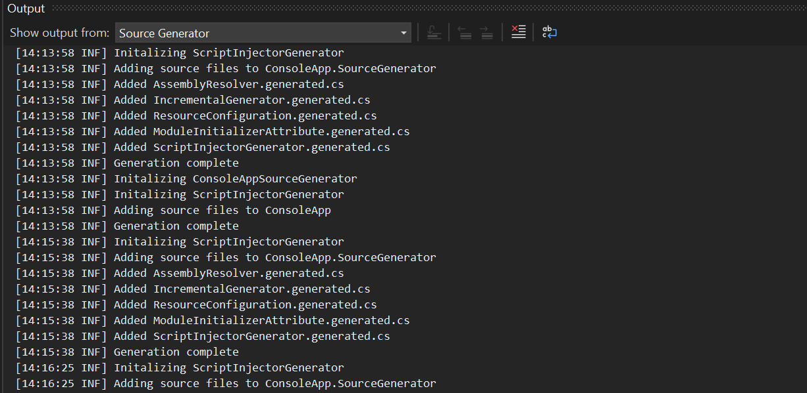
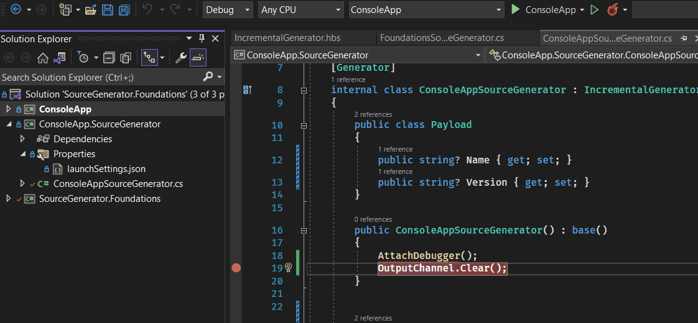
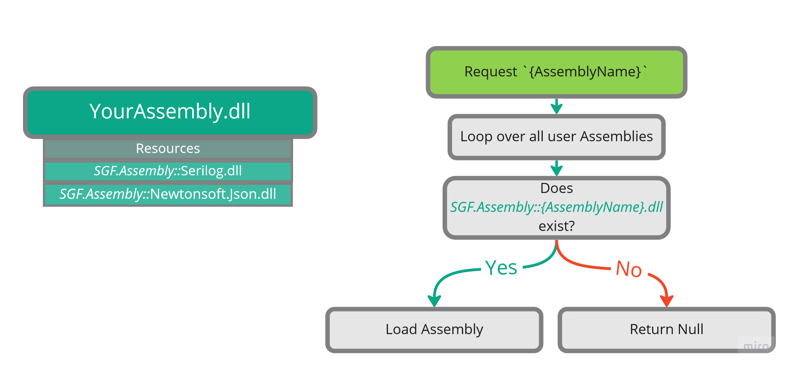

 

# SourceGenerator.Foundations

Source Generators are awesome but working with them can be a bit painful. This library is designed to try to smooth out some bumps. To get started using the library just add a nuget reference. Once that is done you will have access to new types contained within your assembly.

## Quick Start

To get started all you need to do is add the NuGet package reference. You may or may not have to restart Visual Studio for the new types to show up. Then implement the base class `IncrementalGenerator` and apply the `[IncrementalGenerator]` attribute to your type;

```cs
using SGF;

namespace Example
{
    // IncrementalGenerator, is a generated type from `SourceGenerator.Foundations'
    [IncrementalGenerator]
    public class ExampleSourceGenerator : IncrementalGenerator 
    {
        public ExampleSourceGenerator() : base("ExampleSourceGenerator")
        {
            
        }

        // SgfInitializationContext is a wrapper around IncrementalGeneratorInitializationContext
       protected override void OnInitialize(SgfInitializationContext context)
       {
            // Attaches Visual Studio debugger without prompt 
            AttachDebugger();

            // Writes output to Visual Studio's output window
            Logger.Information("Hello World");
       }
    }
}
```

> 🛈 You don't apply the `SourceGenerator` attribute or implement the `IIncrementalGenerator` interface. Behind the scenes Source Generator Foundations is generating a class that will host your generator. This is done so that we can capture all errors and also resolve any type loading.


# What is inside?

There is a series of features this library hopes to provide.

## Nuget Nightmares

Source generators run in a unique place and their references don't act the same. If you have a source generator that attempts to reference a NuGet package it will fail to be found at runtime. The reason is the source generators need to have their dll's alongside the running process but that also means that the project the generator is running aginst will to. If you look online the best option is to do this:

```xml
<ItemGroup>
    <PackageReference Include="Newtonsoft.Json" Version="13.0.1" GeneratePathProperty="true" PrivateAssets="all" />
</ItemGroup>
<ItemGroup>
    <EmbeddedResource Include="$(PKGNewtonsoft_Json)\lib\netstandard2.0\Newtonsoft.Json.dll" Visible="false" />
</ItemGroup>
```
This MSBuild logic adds a reference to `Newtonsoft.Json` version `13.0.1` and sets a few attributes. Using `GeneratePathProperty="true"` will emit the variable `PKGNewtonsoft_Json` which points at the root of the NuGet package on disk. Using `EmbeddedResource` we then give the full path to the dll. When the project is compiled the dlls will be embeded as a resource.

This works well but requires a lot of boilerplate. Even worse is this is just for one package. You would need to repeat this for every dependency and any transitive ones as well. This gets out of hand very fast.


*Source.Generator foundations automates this all for you. Just add your NuGet references and nothing else*

By default, SGF does **not** embed `Microsoft.CodeAnalysis.*` assemblies. Roslyn is provided by the compiler/IDE host at runtime, so embedding those assemblies can cause type identity conflicts and broken design-time behavior.

## Logging Framework
Source generator run in the background and it can be very hard to debug. If you want to make a log you have to write the files to disk and open to read them. 

With this library we leverage the existing Output window and create an entry for each source generator. This is all done by using some Visual Studio api. Internally this uses a custom Sink for [Serilog.net](https://serilog.net/). Every generator comes with a `Logger` property allowing you to output any information

### Log Levels

Every generator includes configurable log levels for fine-grained control over diagnostic output:

- **None** - Disables all logging
- **Trace** - Very detailed diagnostic information  
- **Debug** - Detailed debugging information
- **Information** - General informational messages (default)
- **Warning** - Warning messages
- **Error** - Error messages only

### Configuring Log Levels

**Via MSBuild (Global):**
```xml
<PropertyGroup>
  <SgfLogLevel>Debug</SgfLogLevel>
</PropertyGroup>
```

**Via MSBuild (Per-Generator):**
```xml
<PropertyGroup>
  <!-- Set specific log level for MyGenerator -->
  <SgfLogLevel_MyGenerator>Trace</SgfLogLevel_MyGenerator>

  <!-- All other generators use Warning -->
  <SgfLogLevel>Warning</SgfLogLevel>
</PropertyGroup>
```

**Create Context-Specific Loggers:**
```csharp
public class MyGenerator : IncrementalGenerator
{
    private readonly ILogger parsingLogger;
    private readonly ILogger codeGenLogger;

    public MyGenerator() : base(nameof(MyGenerator))
    {
        // Each aspect gets its own logger with its own level
        parsingLogger = Logger.ForContext<SyntaxParser>();
        Logger.Configuration.SetContextLevel<SyntaxParser>(LogLevel.Trace);

        codeGenLogger = Logger.ForContext<CodeGenerator>();
        Logger.Configuration.SetContextLevel<CodeGenerator>(LogLevel.Debug);
    }

    public override void OnInitialize(SgfInitializationContext context)
    {
        parsingLogger.Trace("Very detailed parsing info");
        codeGenLogger.Debug("Code generation details");
        Logger.Information("General generator info");
    }
}
```

### Available Logging Methods
- `Logger.Trace("message")` / `Logger.Trace(exception, "message")`
- `Logger.Debug("message")` / `Logger.Debug(exception, "message")`
- `Logger.Information("message")` / `Logger.Information(exception, "message")`
- `Logger.Warning("message")` / `Logger.Warning(exception, "message")`
- `Logger.Error("message")` / `Logger.Error(exception, "message")`




### **Captured Exceptions**

When a source generator throws an exception it normally just stops. In the base library we process all exceptions and forward their output to the `Source Generator` output tab. 

```ini
# Build Window 
6>CSC : warning CS8032: An instance of analyzer ConsoleApp.SourceGenerator.ConsoleAppSourceGenerator cannot be created from D:\Repositories\SourceGenerator.Foudations\src\Sandbox\ConsoleApp.SourceGenerator\bin\Debug\netstandard2.0\ConsoleApp.SourceGenerator.dll : Exception has been thrown by the target of an invocation..

# Source Generator Window 
[13:02:39 ERR] ConsoleApp | Unhandled exception was throw while running the generator ConsoleApp
System.NotImplementedException: The method or operation is not implemented.
   at ConsoleApp.SourceGenerator.ConsoleAppSourceGenerator.PostInit(IncrementalGeneratorPostInitializationContext obj) in D:\Repositories\SourceGenerator.Foudations\src\Sandbox\ConsoleApp.SourceGenerator\ConsoleAppSourceGenerator.cs:line 42
   at SGF.SgfInitializationContext.<>c__DisplayClass19_0.<RegisterPostInitializationOutput>b__0(IncrementalGeneratorPostInitializationContext context) in D:\Repositories\SourceGenerator.Foudations\src\Sandbox\ConsoleApp.SourceGenerator\SourceGenerator.Foundations\SGF.Generators.ScriptInjectorGenerator\SgfInitializationContext.generated.cs:line 106

```
In this case my source generator just throws `NotImplementedException` but all details are lost with the build in framework. Using the source generator tab it will give you a full call stack.

This is done by implementing a wrapper around `IncrementalGeneratorInitializationContext` which is called `SgfInitializationContext`. This will wrap every single subscription in a `try {} catch {}` and give details whenever an unhandled exception is thrown.


### Debugging 

Traditional debugging of source generators requires boilerplate code that shows an annoying prompt:

```csharp
static CustomSourceGenerator()
{
    Debugger.Launch(); // Shows dialog every time
}
```

This shows a debugger selection dialog every time the generator runs, which is disruptive during development.

**With SGF, just call `AttachDebugger()`:**

```csharp
[IncrementalGenerator]
public class MyGenerator : IncrementalGenerator
{
    public MyGenerator() : base(nameof(MyGenerator)) { }

    public override void OnInitialize(SgfInitializationContext context)
    {
        AttachDebugger(); // Automatically attaches to current VS instance - no prompt!

        // Set breakpoints here - they now work!
        Logger.Debug("Debugging is now active");
    }
}
```

The debugger will automatically attach to the current Visual Studio instance without any prompts or dialogs.



## Helpers 

Included in the project is a series of helper classes to help you while working on your generator.

### SGFPath 

* Contains methods for normalizing paths which does the following 
  * `files/../cats` -> `/cats`
  * [Windows] `files\cats/dogs` -> `\\files\\cats\\dogs` 
  * [Linux|Mac] `files\cats/dogs` -> `/files/cats/dogs` 
* Combing paths without having to worry about leading or trailing slashes.

# How it works

## Assembly Resolver
When your source generator runs it needs to find it's dependencies and this is often what fails. When you want to provide external packages you will have to write your own resolve that is able to locate the required assemblies. So instead we have the `ScriptInjector` inject an implemention for you. This assembly resolver will loop over all the resources in the current assembly and look for all resources that start with `SGF.Assembly::`. If the assembly being requested to be loaded exists in the resources, it's extracted and loaded into the current appdomain. 



You can embed any assemblies you want by adding them to `<SGF_EmbeddedAssembly Include="Your Assembly Path"/>`.

`Microsoft.CodeAnalysis.*` assemblies are excluded from SGF dependency embedding by default. If you need the previous behavior, opt in explicitly:

```xml
<PropertyGroup>
  <SGFEmbedCodeAnalysis>true</SGFEmbedCodeAnalysis>
</PropertyGroup>
```

You can also exclude additional assemblies by name (with optional wildcard support):

```xml
<ItemGroup>
  <SGFExcludedAssembly Include="My.Host.Provided.Dependency" />
  <SGFExcludedAssembly Include="Company.Shared.*" />
</ItemGroup>
```

## Diagnostic Analyzer

Included with this package is a code analyzer that will be used to catch common mistakes when working with this library.


### `SGF1001`
**Has SgfGenerator Attribute**

Any class that inherits from `IncrementalGenerator` is required to have the `SgfGenerator` attribute applied to it. 

```cs
// Error 
public class MyGenerator : IncrementalGenerator 
{
    public MyGenerator() : base("MyGenerator")
    {}
}
```

To fix the error just apply the attribute.

```cs 
// Fixed 
[IncrementalGenerator]
public class MyGenerator : IncrementalGenerator 
{
    public MyGenerator() : base("MyGenerator")
    {}
}
```

### `SGF1002`

**Prohibit Generator Attribute**

If an `IncrementalGenerator` has the `Generator` attribute applied it will cause a compiler error. The reason being that the `Generator` attribute is used on classes that implement `IIncrementalGenerator` which `IncrementalGenerator` does not. SGF has it's own attribute to not confuse roslyn. SGFs `IncrementalGenerator` is run from within a wrapper to help capture exceptions and handle runtime type resolving. 

```cs
// Error 
[Generator]
public class MyGenerator : IncrementalGenerator 
{
    public MyGenerator() : base("MyGenerator")
    {}
}
```

To fix the error just remove the attribute.

```cs 
// Fixed 
public class MyGenerator : IncrementalGenerator 
{
    public MyGenerator() : base("MyGenerator")
    {}
}
```

### `SGF1003`
**Has Default Constructor**

`IncrementalGenerator` require a default constructor so they can be instantiated at runtime. If no constructor is defined the generator will never be run. 

```cs
// Error 
public class MyGenerator : IncrementalGenerator 
{
    public MyGenerator(string name) : base(name)
    {}
}
```

Add a default constructor that takes no arguments.

```cs 
// Fixed 
public class MyGenerator : IncrementalGenerator 
{
    public MyGenerator() : base("MyGenerator")
    {}
}
```

### `SGF1004`
**ModuleInitializerAttribute Conflict**

SGF adds the `ModuleInitializerAttribute` by default for .NET Standard 2.0 compatibility. If your project already defines this attribute or references a library that provides it, you must disable SGF's version to avoid duplicate definition errors.

```csharp
// Error - ModuleInitializerAttribute is already defined in the compilation
[IncrementalGenerator]
public class MyGenerator : IncrementalGenerator 
{
    public MyGenerator() : base("MyGenerator") {}

    public override void OnInitialize(SgfInitializationContext context) {}
}
```

**Fix:** Add this property to your `.csproj` file:
```xml
<PropertyGroup>
  <SgfAddModuleInitializerAttribute>false</SgfAddModuleInitializerAttribute>
</PropertyGroup>
```

After adding this property, the error will be resolved and your generator will compile successfully.

## Unit Tests
You can write unit test to validate that your source generators are working as expected. To do this for this library requires a very tiny amount of extra work. You can also look at the [example project](src/Sandbox/ConsoleApp.SourceGenerator.Tests/TestCase.cs) to see how it works. 

The generated class will all be internal so your unit test assembly will need to have viability.

```csharp
using System.Runtime.CompilerServices;

[assembly: InternalsVisibleTo("ConsoleApp.SourceGenerator.Tests")]
```

Then for your unit test functions the only difference will be that instead of creating an instance of your class you create an instance of the `Hoist` class.

```csharp
// Create the instance of our generator and set whatever properties 
ConsoleAppSourceGenerator generator = new ConsoleAppSourceGenerator()
{
    Explode = true
};

// Build the instance of the wrapper `Hoist` which takes in your generator
ConsoleAppSourceGeneratorHoist host = new ConsoleAppSourceGeneratorHoist(generator);

// From here it's just like testing any other generator
GeneratorDriver driver = CSharpGeneratorDriver.Create(host);
driver = driver.RunGenerators(compilation);

// Assert on the results
GeneratorDriverRunResult runResult = driver.GetRunResult();
Assert.NotEmpty(runResult.GeneratedTrees);
```
The only unique feature is the wrapper class `{YourGeneratorName}Host`. This class is an internal feature of `SGF` and is used to make sure all dependencies are resolved before calling into your source generator. 


## Advanced Features
There are some features that are designed for more advanced users or niche cases. 

### Debugger Attaching 
When your source generator is being used in the wild it can happen there are exceptions that are thrown which can be hard to track down. There is no nice way to debug these issues besides logging. To get around this you can set the environment variable `SGF_DEBUGGER_LAUNCH=true` the debugger will be launched at the entrypoint of SGF. 


## Projects Using SGF
 * [ByronMayne.AutoFactories](https://github.com/ByronMayne/AutoFactories)
 * [AssetRipper.AssetRipper](https://github.com/AssetRipper/AssetRipper)

*Want to add your project here? Just make a PR*

## Attribution 
Icon by <a href="https://www.flaticon.com/free-icons/drywall" title="drywall icons">Drywall icons created by HAJICON - Flaticon</a>
